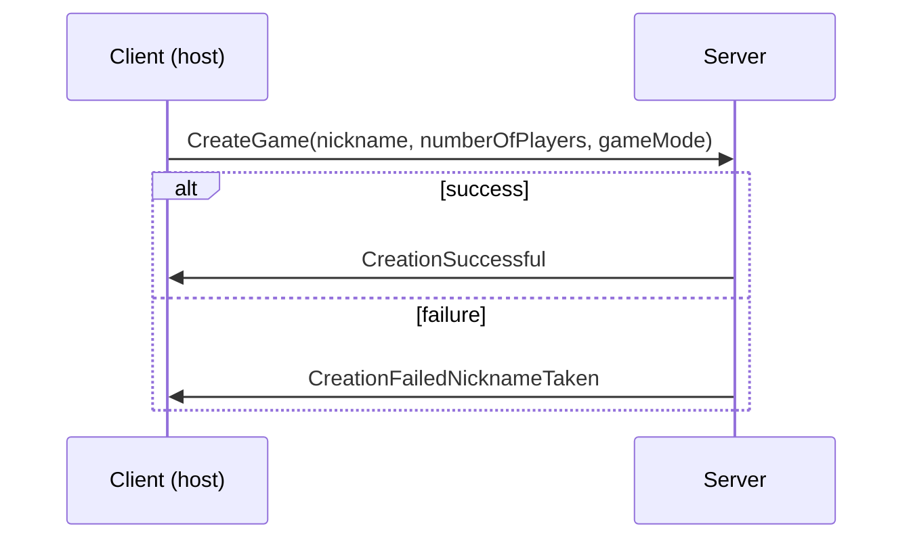
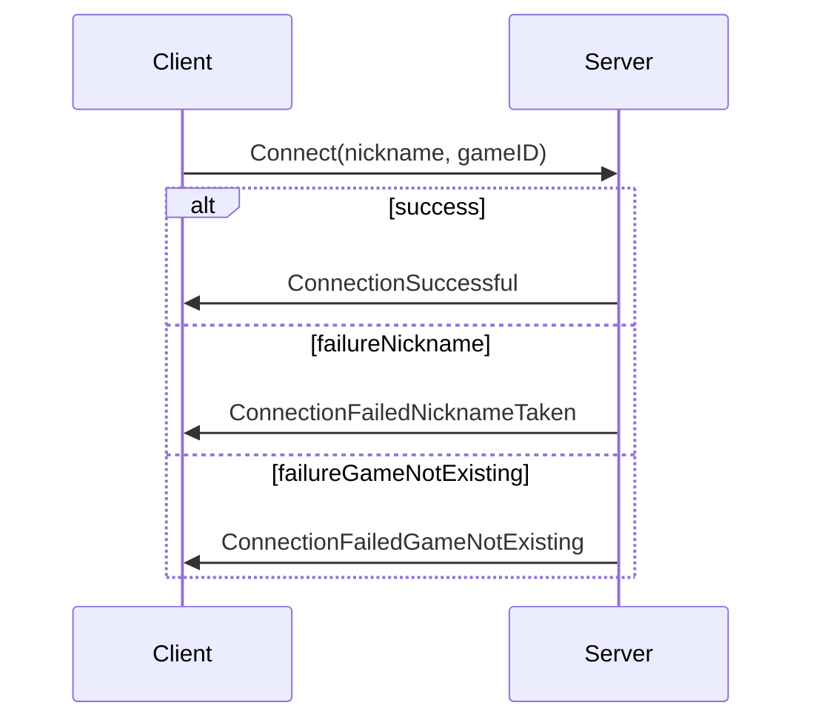
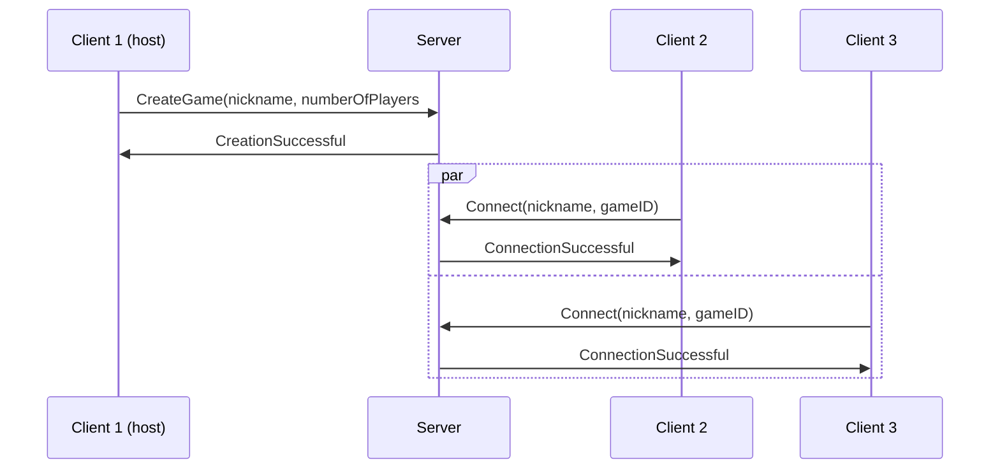
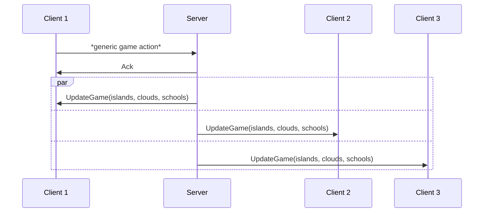

# Eryantis Protocol Documentation

Fernando Morea, Lorenzo Morelli, Ignazio Neto Dell'Acqua

Group 28

## Architecture

#### A real time thin client protocol
For the implementation of the communication protocol we chose to use the thin client approach, in the context of a
real time turn based game.
First of all, the client has to specify its nickname and ip/port address of the server. If the data provided
by the client is wrong or the connection to the specified ip/port fails, then the client has to specify again
the connection infos.
Once the client is connected to the server, it asks to the server if it is the first one, with a .json serialized
message containing a boolean “amIFirst”. If the server responds affirmatively (amIFirst = true),
then the client has to specify the game mode and the number of players he wants to play with,
otherwise it goes directly into the “command wait state”.
In this “command wait state” there are only 3 type of allowed messages that a client can receive:
- A “request to me” message, that is a command from the server to write something in the terminal.
- A “request to other” message, that is a command from the server to another client that is currently 
interacting with the terminal
- A “response” message, from a client to the server.

The following IFML diagram describes the client architecture as an event-driven finite state machine.

## Messages
The real implementation may differ relatively to this high level description.

### Ack
This message is sent from the server to the client when a generic message has been acknowledged.

#### Arguments
This message has no arguments.

#### Possible responses
- UpdateGame: the game view is updated.

### UpdateGame
This message is sent from the server to the client to update the game view.

#### Arguments
- Islands: the status of the islands.
- Clouds: the status of the clouds.
- Schools: the status of all the players' schools.

#### Possible responses
This message has no responses.

### CreateGame
This message is sent from the host client to create a new game.

#### Arguments
- nickname: the host's nickname.
- numberOfPlayers: the numbers of players.
- gameMode: the choice between principiant and expert mode.

#### Possible responses
- CreationSuccessful: the game has been created without any problem.
- CreationFailedNicknameTaken: the game has failed its creation because the host's nickname is already used.

### CreationSuccessful
This message is sent from the server to the client when a new game is successfully created.

#### Arguments
- GameID: the unique ID created for the game.

#### Possible responses
- StartGame: to start the game.

### CreationFailedNicknameTaken
This message is sent from the server to the client when a new game couldn't be created because the host's nickname is
used.

#### Arguments
This message has no arguments.

#### Possible responses
- CreateGame: the command to create another game.

### Connect
This message is sent from the client to connect to an existing game.

#### Arguments
- Nickname: the user's nickname.
- GameID: the gameID for the game the user wants to connect to.

#### Possible responses
- ConnectionSuccessful: the game has been created without any problem.
- ConnectionFailedNicknameTaken: the connection to the game has failed because the host's nickname is already used.
- ConnectionFailedGameNotExisting: the connection to the game has failed because there isn't any game related to that
  ID.

### ConnectionSuccessful
This message is sent from the server when the client is able to connect to an existing game.

#### Arguments
This message has no arguments.

#### Possible responses
- StartGame: to start the game.

### ConnectionFailedNicknameTaken
This message is sent from the server to the client when it's impossible to connect to a game because the nickname has
already been taken.

#### Arguments
This message has no arguments.

#### Possible responses
- Connect: the command to connect to another game.

### ConnectionFailedGameNotExisting
This message is sent from the server to the client when it's impossible to connect to a game because there isn't any
game related to that ID.

#### Arguments
This message has no arguments.

#### Possible responses
- Connect: the command to connect to another game.

### StartGame
This message is sent from the client host to start the game.

#### Arguments
This message has no arguments.

#### Possible responses
- InitializeGame: to initialize and load the client's view for a new game.

### InitializeGame
This message is sent from the server to the all the clients, including all the components to start a new game.

#### Arguments
- centerTable: a list with all the elements for the game (islands, students, ...)
- assistantCards: the deck with the player's assistant cards
- otherPlayersNicknames: the list with the nicknames of all the other players.

#### Possible responses
- PlayAssistantCard: to play a new assistant card.

### PlayAssistantCard
This message is sent from the client when they want to play an assistant card.

#### Arguments
- choosenAssistantCard: the card they want to play.

#### Possible responses
- Ack: the messages has been received.

### MoveStudent
This message is sent from the client when they want to move a student.

#### Arguments
- student: the student they want to move.

#### Possible responses
- Ack: the messages has been received.

### MoveMotherNature
This message is sent from the client when they want to move mother nature.

#### Arguments
- numberOfMoves: the number of moves of mother nature.

#### Possible responses
- Ack: the messages has been received.

### EndGame
This message is sent from the server to the client when the game is ended.

#### Arguments
- winnerName: the nickname of the winner.

#### Possible responses
- StartGame: to start another game with the same players.

## Scenarios

### Game creation

Description

### Game connection

Description

### Example with successful game creation and connection

### Ack and update game

This sequence diagram shows how every client's view is updated after any player's game action.

